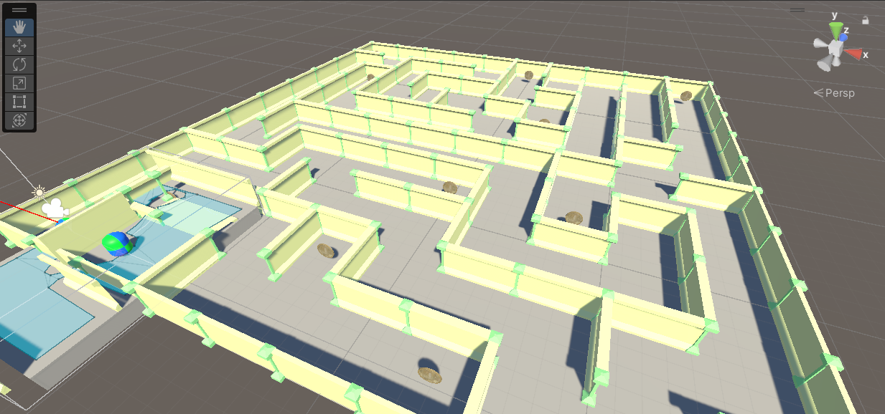
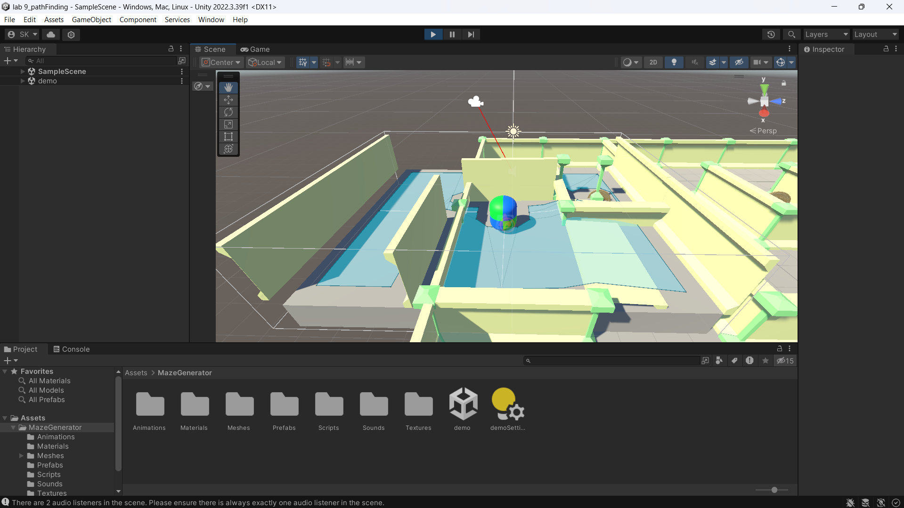

Maze AI Pathfinding Using NavMesh Algorithm
=================================================

This project focuses on creating a maze, implementing an AI component, and scripting an AI agent to navigate through the maze using the NavMesh algorithm. The AI will autonomously find the shortest path to reach the destination.


## Project Objective

*Example image*


##


## Key Features
- [x] 🧩 **Maze Generation** – Design a structured maze layout for AI navigation
- [x] 🗺️ **NavMesh Pathfinding** – AI finds the best path dynamically using navigation mesh
- [x] 🤖 **AI Agent Movement** – The AI character automatically follows the derived path
- [x] 🎮 **Game Scene Integration** – Interactive environment for testing AI navigation
- [x] 📌 **Custom Register Number Placement** – Add your register number to personalize the scene

## How to Use

1. **Prepare Your Environment: .**:
- Install Unity or another game engine supporting NavMesh
- Ensure NavMesh Components are enabled

2. **Clone the Repository**:
    ```sh
    git clone https://github.com/Sandhit06/LLM-Semantic-Book-Recommender.git
    ```

3. **Run the Simulation**:
- Open the project in Unity
- Press Play to test AI movement in the maze


## ⚠ Disclaimer
This tool is developed for educational and developmental purposes. It's crucial to understand the implications and responsibilities of using such technologies in real-world applications.


## Still need help?
Open an issue on our GitHub repository, and we will help you as soon as possible.

Enjoy exploring and extending this project! Feel free to contribute and suggest improvements.

## Contact

If you want to contact me you can reach me at [Twitter](https://x.com/SandhitK).

## Developer
<table>
    <tr align="center">
        <td>
        Sandhit Karmakar
        <p align="center">
            
        </p>
            <p align="center">
                <a href = "https://github.com/Sandhit06">
                    
                </a>
                <a href = "https://www.linkedin.com/in/sandhit-karmakar/" target="_blank">
                    
                </a>
                <a href = "mailto:sandhitkarmakar@gmail.com" target="_blank">
                    
                </a>
            </p>
        </td>
    </tr>
</table>

<p align="center">
    Made with ❤️ by <a href="https://github.com/Sandhit06">Sandhit Karmakar</a>
</p>
